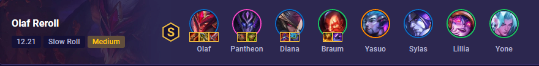

# Top TFT Comps & Builds

## **Meta Expert** ⭐

- https://www.twitch.tv/aceofspadeshots
- https://www.youtube.com/channel/UC-9lydRPVigdLzqPp9nEsxw

Last updated: today

Find out the strongest and most reliable meta Teamfight Tactics comps and builds the best players have been playing, so you can start your game with a leg up on the competition. Our team comps are curated by Challenger expert Ace of Spades.

## *Meta Team Comps*
1. OLAF RE ROLL  
This comp builds upon the Scalescorn trait that doesn't want you to use a Dragon, but having Olaf and Diana 3 star more than makes up for that. You will need to slow roll at level 7 or 8 to hit your key units.

2. JADE WHISPERS

   This comp is all about combining the 2 traits - Jade & Whispers. The green Dragon Shi Oh Yu and the purple Dragon Sy'fen are your core units that'll need a similar itemization - but once you get it online - you'll have a really powerful board!

 